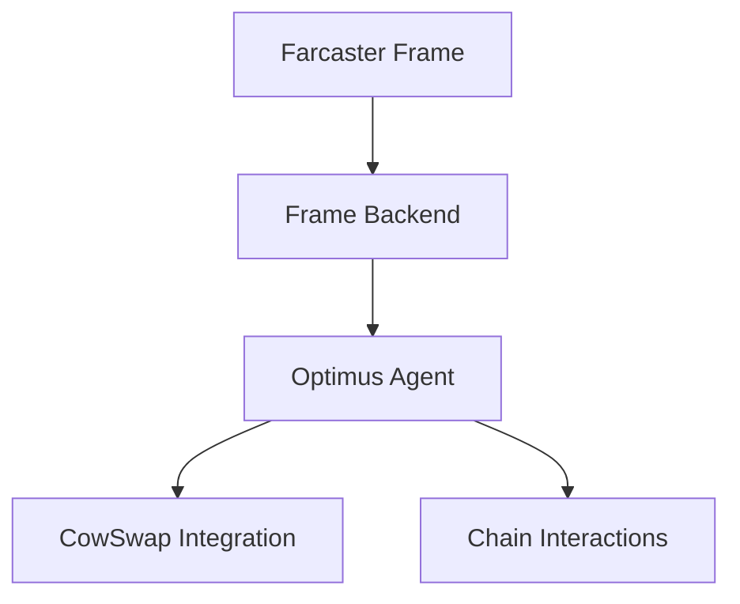

# Architecture Overview

## High-Level Components

## Core Components
1. **Frame Interface**
   - Status display
   - Action buttons
   - Position overview

2. **Agent Core**
   - Position management
   - Strategy execution
   - Multi-chain operations

3. **Integrations**
   - CowSwap orders
   - Liquidity management
